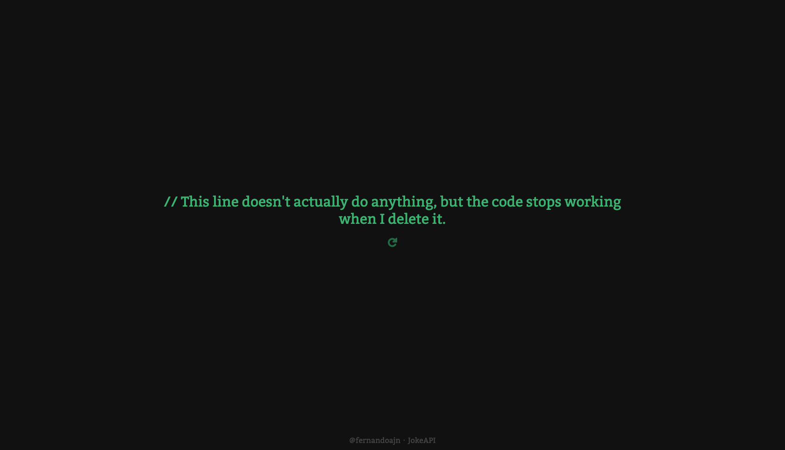

# Dark Jokes
Read uniformly and well formatted jokes. ✅

> **Note:** JokeAPI has been a target of DoS attacks in the past, which is why there is now a limit of 60 requests per minute and why joke
> submissions are manually curated.

## Running it

 1. Clone this repository
 2. Install dependencies by running `$ yarn`
 3. Then run `$ yarn start` and there you go!

## Credits
This project retrieves the jokes from [JokeAPI](https://sv443.net/jokeapi/v2)

This project was bootstrapped with [Create React App](https://github.com/facebook/create-react-app).
